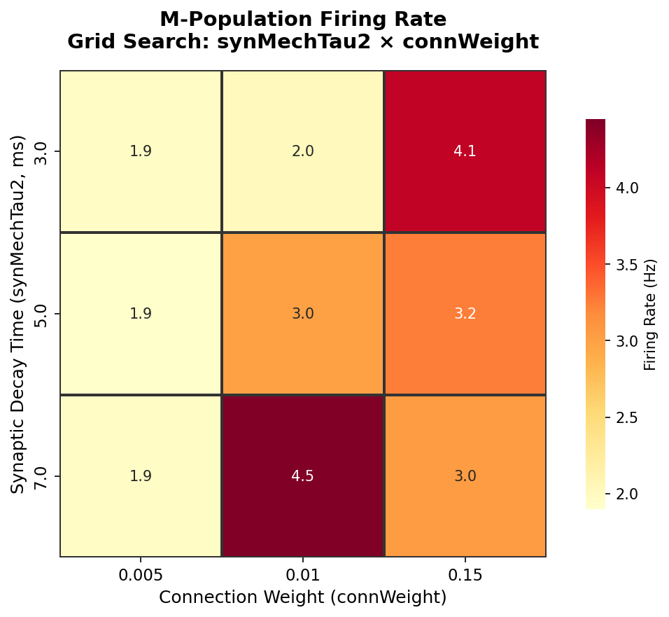

# NetPyNE Batch Viz Prototype

A proof-of-concept that demonstrates understanding of [NetPyNE](https://github.com/suny-downstate-medical-center/netpyne)'s batch simulation data flow — from parameter sweep to fitness visualization.

## What This Does

Runs a grid search over two synaptic parameters on a small Hodgkin-Huxley network (based on NetPyNE's tut8 batch tutorial), then generates heatmap visualizations showing how each parameter combination affects network firing.

**Parameter sweep:**
- `synMechTau2` — synaptic decay time constant (3, 5, 7 ms)
- `connWeight` — S→M connection weight (0.005, 0.01, 0.15)

**Network:** 40 single-compartment HH neurons in two populations (S and M, 20 each), with 50% S→M connectivity and 10 Hz Poisson background drive.

## Results



The heatmap shows M-population firing rate across the 3×3 parameter grid. Higher connection weights consistently increase postsynaptic (M) firing, and longer synaptic decay times amplify that effect — which is exactly what you'd expect from the biophysics.

## Setup

```bash
pip install -r requirements.txt
```

## Usage

```bash
# run the 3x3 batch simulation (~30s)
python run_batch.py

# generate the heatmap figures
python visualize_batch.py
```

Output goes to `figures/`.

## Files

| File | Purpose |
|---|---|
| `run_batch.py` | Standalone HH batch simulation (no NEURON needed) |
| `visualize_batch.py` | Reads batch JSON output, generates heatmaps |
| `tut8_cfg.py` | Simulation config (NetPyNE format) |
| `tut8_netParams.py` | Network parameters (NetPyNE format) |
| `tut8_init.py` | NetPyNE init script |
| `tut8_batch.py` | NetPyNE batch runner (needs NEURON installed) |

> **Note:** `run_batch.py` is a pure-numpy reimplementation of the HH model that doesn't require NEURON. If you have NEURON installed (Python ≤3.12), you can use the original `tut8_batch.py` instead.

## Tech Stack

Python 3.10+ · NumPy · Pandas · Matplotlib · Seaborn
